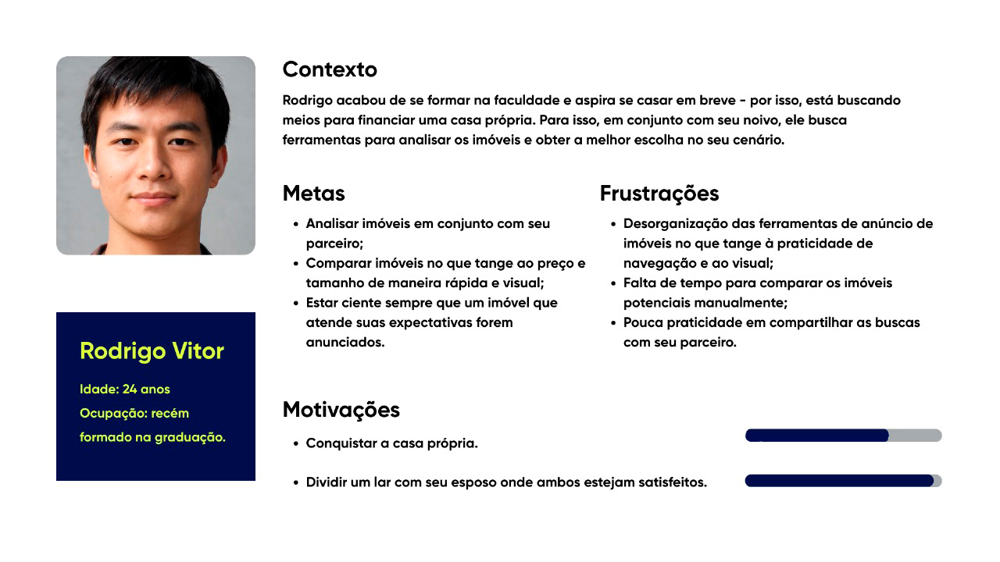
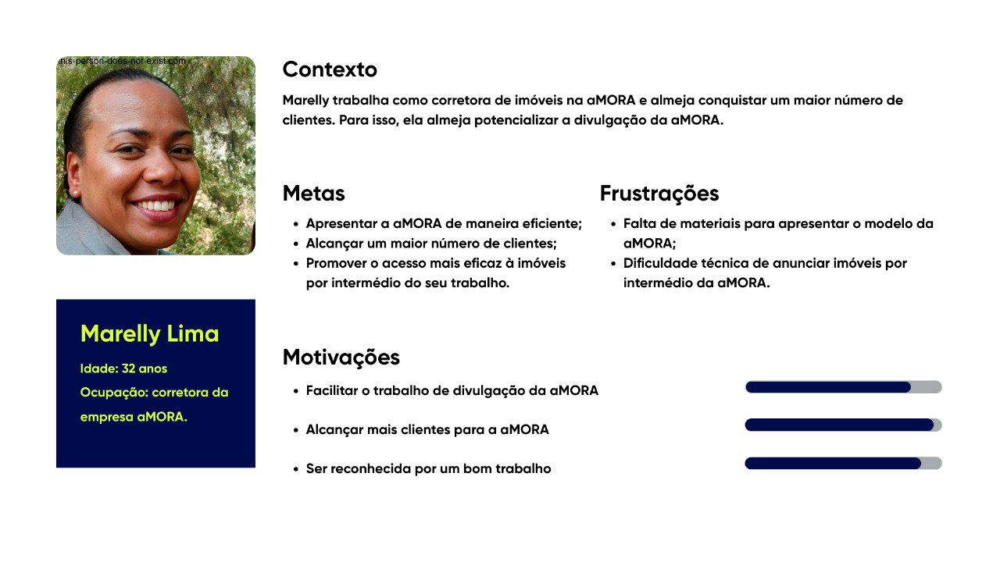

# Documentação do Projeto

## aMORADORES

A ferramenta configura-se como uma plataforma gratuíta que conecta corretores de imóveis e potenciais clientes, assim como facilita a organização e a praticidade no processo de busca e análise de imóveis. 

## 📋 Índice

# Índice da Documentação Técnica do Projeto aMORA

## 1. Visão Geral

1.1. Introdução 

1.2. Objetivos e Justificativa  
1.3. Funcionalidades
1.4. Solução para os Problemas  

## 2. Análise Estratégica
2.1. Contexto da Indústria  
2.2. Tendências do Setor  
2.3. Concorrentes  
2.4. Análise SWOT  
2.5. Análise das 5 Forças de Porter  
2.6. Modelo de Negócio  
2.7. Value Proposition Canvas  

## 3. Planejamento da Solução
3.1. Compreensão do Problema  

### 3.2. Personas  

As personas são representações semifictícias criadas para ilustrar perfis de usuários com comportamentos, objetivos e desafios semelhantes aos do público real de uma solução. Elas são amplamente utilizadas em projetos de tecnologia, design e ciência de dados para orientar decisões centradas nas necessidades e experiências humanas. Ao sintetizar características como motivações, frustrações e contexto, as personas ajudam a compreender melhor os diferentes pontos de vista envolvidos na aplicação de uma ferramenta ou serviço.

Diante disso, foram desenvolvidas as seguintes personas para o projeto:

As quatro personas desenvolvidas podem ser visualizadas a seguir.
    

Figura 1 - Primeira Persona

  

Fonte: Material produzido pelas autoras (2025).

Figura 2 - Segunda Persona

  

Fonte: Material produzido pelas autoras (2025).

3.3. Jornada do Usuário  
3.4. Planejamento Geral da Solução  

## 4. Detalhamento Técnico
4.1. Decisões Técnicas  
4.2. Tecnologias Utilizadas  
4.3. Estrutura do Projeto  

## 5. Conclusão e Próximos Passos
5.1. Próximos Passos  
5.2. Referências  
5.3. Contato  

## Visão Geral

Este projeto é uma solução full-stack em **TypeScript** para o desafio técnico da aMORA. O objetivo é criar uma plataforma que facilite a busca, organização e comparação de imóveis, promovendo colaboração entre usuários e corretores, com engajamento contínuo através de notificações e potencial de viralização orgânica.

**Link da Aplicação Hospedada**: [https://amora-challenge.vercel.app](https://amora-challenge.vercel.app)

## Funcionalidades

- **Salvar e organizar imóveis** via link por input manual;
- **Sistema de notificações** por e-mail e WhatsApp para imóveis similares;
- **Modo colaborativo** para casais, famílias e corretores
- **Páginas personalizadas** para corretores apresentarem a aMORA
- **Captação de leads** sem login obrigatório e integração com WhatsApp

## 🛠 Tecnologias Utilizadas

### Frontend
- **Next.js 14** (App Router)
- **TypeScript**
- **Tailwind CSS**
- **NextAuth.js** (autenticação)
- **React Query** (gerenciamento de estado)
- **Zod** (validação)

### Backend
- **NestJS**
- **TypeScript**
- **PostgreSQL** (com Prisma ORM)
- **JWT** (autenticação)
- **BullMQ** (filas para notificações)

### Serviços Externos
- **Twilio** (WhatsApp API)
- **Resend** (transacional e-mails)
- **Vercel** (deploy frontend)
- **Railway** (deploy backend e banco)
