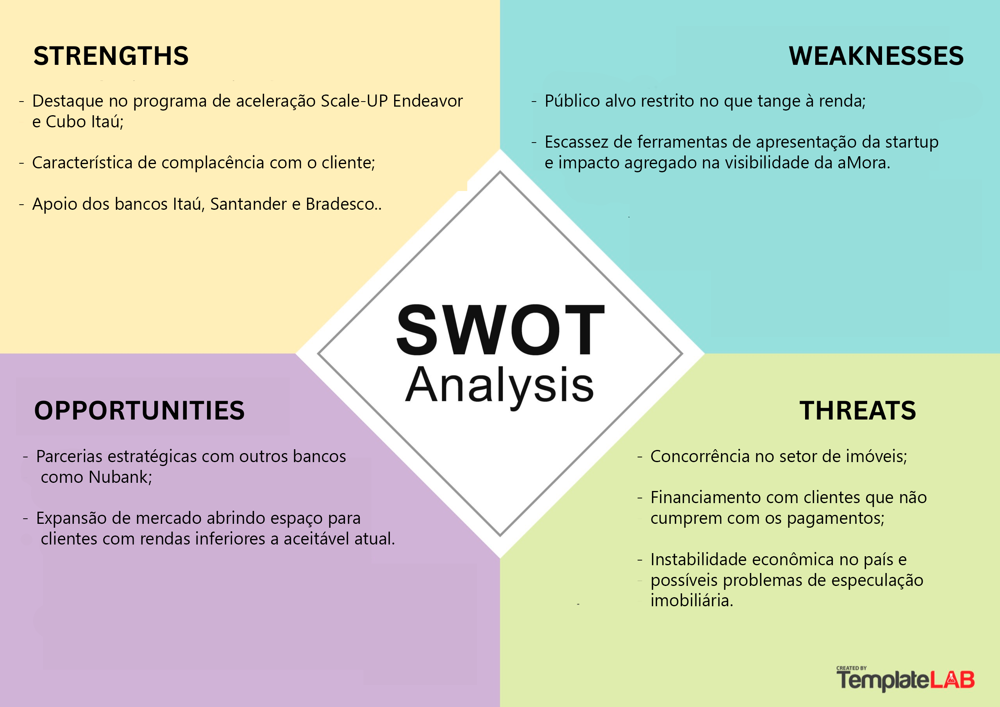

# Documentação do Projeto

## aMORADORES

## 1. Introdução 

&nbsp; &nbsp; &nbsp; &nbsp;A ferramenta configura-se como uma plataforma gratuita que conecta corretores de imóveis e potenciais clientes, assim como facilita a organização e a praticidade no processo de busca e análise de imóveis. Paralelamente, a solução contempla página de cadastro de imóveis para os corretores e visa mitigar a problemática que tange à falta de ferramentas para a apresentação da aMORA.

## 2. Contexto da Indústria

### 2.1 Análise SWOT  

&nbsp; &nbsp; &nbsp; &nbsp;A análise SWOT é uma ferramenta de gestão empresarial utilizada para compreender em qual situação uma empresa se encontra no que que tange aos fatores internos - forças e fraquezas - e externos  - ameaças e oportunidades - (SEBRAE, 2023). 

&nbsp; &nbsp; &nbsp; &nbsp;Diante disso, a análise SWOT foi desenvolvida, com a finalidade de, por intermédio da compreenção do cenário no qual a startup está inserida, garantir que a solução seja, de fato, efetiva no contexto e no quadro da aMORA.

 Figura 1 - Análise SWOT 

Fonte: Material produzido pelos autores (2025)

### 2.2 Value Proposition Canvas  
&nbsp; &nbsp; &nbsp; &nbsp;Criado por Alexander Osterwalder, Yves Pigneur e Alan Smith, o Canvas Proposta de Valor configura-se como uma ferramenta que objetiva facilitar a criação de produtos e serviços de acordo com as necessidades do cliente - consoante Pereira (2024). Sob essa ótica, faz-se necessário destacar que o instrumento é dividido nos seguintes blocos: “Perfil do Cliente” - a qual apresenta as tarefas, dores e ganhos do cliente - e “Proposta de Valor” - esta que contempla os produtos e serviços, os aliviadores de dor e os ganhos que o projeto vai fornecer. Além disso, é válido mencionar que para cada ganho há um criador de ganho relacionado, assim como para cada dor existe um aliviador de dor correspondente e para cada tarefa do cliente encontra-se um item em serviço e produto que favorecerá o processo de realização da atividade. Nessa esfera, torna-se possível a clara compreensão do que é imprescindível para suprir as demandas do cliente, garantindo, dessa forma, a proposta de valor do produto.

&nbsp; &nbsp; &nbsp; &nbsp;À luz disto, segue o Canvas Proposta de Valor do projeto aMORADORES na figura 2 e a explicação detalhada de cada segmento dos blocos do Canvas Proposta de Valor:

    
Figura 2 - Primeira Persona 

Fonte: Material produzido pelos autores (2025)

### 3. Personas  

&nbsp; &nbsp; &nbsp; &nbsp;As personas são representações semifictícias criadas para ilustrar perfis de usuários com comportamentos, objetivos e desafios semelhantes aos do público real de uma solução. Nessa esfera, ao sintetizar características como motivações, frustrações e contexto, as personas ajudam a compreender melhor os diferentes pontos de vista envolvidos na aplicação de uma ferramenta ou serviço.

&nbsp; &nbsp; &nbsp; &nbsp;Diante disso, foram desenvolvidas as seguintes personas para o projeto:

    
Figura 3 - Primeira Persona 
    

Fonte: Material produzido pelos autores (2025)

&nbsp; &nbsp; &nbsp; &nbsp;A persona supracitada corresponde ao usuário que busca um imóvel.

    
Figura 4 - Segunda Persona 
    

  
Fonte: Material produzido pelos autores (2025)

&nbsp; &nbsp; &nbsp; &nbsp;A persona acima representa o perfil do corretor de imóveis da aMORA.

### 4. Referências

SEBRAE. Conheça a Análise SWOT: Aprenda como fazer e os benefícios de utilizar essa ferramenta de planejamento. [S. l.], 19 abr. 2023. Disponível em: https://sebrae.com.br/sites/PortalSebrae/conheca-a-analise-swot,202f64e8feb67810VgnVCM1000001b00320aRCRD. Acesso em: 7 ago. 2025.

PEREIRA, Daniel. O que é o Value Proposition Canvas?. [S. l.], 27 set. 2024. Disponível em: https://businessmodelanalyst.com/pt/value-proposition-canvas/. Acesso em: 27 mar. 2025.
